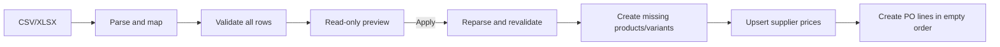

## Context

В репозитории нет модуля с похожим импортом; новая функция будет изолирована в addon `main/purchase_import`. Затронуты стандартные `purchase.order`, `purchase.order.line`, `product.template`, `product.product`, `product.supplierinfo` и парсеры `base_import` Odoo 19.

Стандартный импорт уже читает CSV/XLSX и выбирает лист, но его XLSX reader удаляет полностью пустые строки. Поэтому он не сохраняет физическую нумерацию строк отчётных листов и не позволяет надёжно отделить таблицу от итогов. `base_import.mapping` хранит лишь глобальное соответствие имени колонки и поля модели, поэтому не покрывает именованные company-aware профили и бизнес-цели вроде атрибута варианта.

Odoo 19 уже предоставляет:

- `product.template._get_variant_for_combination()` для поиска комбинации;
- `product.template._is_combination_possible()` для проверки комбинации;
- `product.template._create_product_variant()` для создания dynamic-варианта;
- `purchase.order.line._prepare_add_missing_fields()` и стандартные compute/onchange-механизмы для описания, налогов и даты;
- variant-specific `product.supplierinfo` с полями поставщика, компании, валюты, UoM и `min_qty`.

## Goals / Non-Goals

**Goals:**

- Дать рабочий server-side импорт CSV/XLSX в существующий draft PO без дублирования purchase workflow.
- Сохранять company-aware профили файла, mapping, lookup и product defaults.
- Разделить неизменяющий preview и атомарное apply с повторной server-side проверкой.
- Искать товар детерминированно, создавать standalone product или dynamic-вариант на существующем шаблоне.
- Заполнять только полностью пустой `purchase.order` и синхронизировать variant-specific `product.supplierinfo`.
- Сохранить обычный purchase flow без изменений, если импорт не запускался.

**Non-Goals:**

- Создание PO или изменение его шапки из файла.
- Импорт в PO с существующей product, section или note строкой; merge, замена и удаление старых строк.
- Импорт в не-draft PO, обход доступов, background jobs и частичный success.
- Нечёткий поиск, создание атрибутов/значений или изменение attribute lines шаблона.
- Конверсия цен из валюты файла, импорт скидок/диапазонов дат и вложений.
- Автоматическая агрегация одинаковых строк.

## Decisions

### 1. Отдельный addon и обычный backend wizard

Создаётся addon `purchase_import` с зависимостями `purchase` и `base_import` (`product` уже транзитивно доступен, но может быть указан явно для читаемости). Действие на форме `purchase.order` открывает многошаговый modal wizard. После чтения файла wizard показывает mapping lines, а после validation — нормализованные preview lines. На этапах mapping и preview остаётся вторичная кнопка повторного чтения: пользователь может заменить файл или параметры, перестроить mapping и сбросить устаревший preview без закрытия wizard.

Отдельный OWL client action для MVP не нужен: обычные form/list views покрывают mapping и preview и снижают риск патча стандартного фронтенда импорта.

### 2. Постоянный профиль и его mapping

Постоянные модели:

- `purchase.import.profile`: `name`, `active`, `company_id`, CSV options, XLSX sheet name, `header_row`, `data_row`, ordered lookup configuration, unmatched policy, creation mode, `variant_template_id` и defaults нового standalone product (`type`, category, purchase/sales flags, UoM, purchase UoM, taxes, tracking);
- `purchase.import.profile.mapping`: ссылка на профиль, нормализованное имя source column, target kind, target field и, для attribute target, `product.attribute`;
- `purchase.import.profile.lookup`: порядок exact-lookup по `supplier_code`, `default_code` и `barcode`.

Строки mapping не хранят Python expressions или произвольные ORM field paths: target выбирается из безопасного фиксированного набора. SQL/ORM constraints запрещают дублирующиеся target и имя профиля в одной компании. Строка заголовков и строка данных — человеко-ориентированные 1-based номера; `data_row > header_row`. Для XLSX они означают физические строки выбранного листа, включая пустые строки между реквизитами документа.

### 3. Transient-состав wizard

Временные модели:

- `purchase.order.line.import.wizard`: PO, профиль, binary-файл, file options, state и summary;
- `purchase.order.line.import.mapping`: копия/редакция mapping для текущего файла;
- `purchase.order.line.import.preview`: source row, normalized values, resolved product, planned creation и error text.

Файл и preview остаются transient и не становятся источником бизнес-данных. CSV читается через локальный adapter к `base_import.import`. XLSX читается отдельной веткой того же adapter через уже доступный в Odoo runtime `openpyxl`, потому что standard `base_import` удаляет пустые строки до применения `header_row`/`data_row`. Локальная XLSX-ветка сохраняет физические строки, стандартное преобразование значений и выбор листа; custom semantic mapping не передаётся в `load()`.

Из физической строки заголовков source columns создаются только для непустых anchor cells. Это поддерживает печатные формы с merged cells: пустые ячейки внутри объединённого диапазона не становятся колонками и не сдвигают значения именованных колонок. Начиная с `data_row`, XLSX-таблица считается непрерывным блоком и заканчивается перед первой полностью пустой физической строкой; totals, VAT и подписи ниже такого разделителя не попадают в preview. После mapping дополнительно отбрасываются строки, где все mapped values пусты.

### 4. Поток данных и два режима

`action_preview` только читает файл, нормализует типы, batch-поиском разрешает products/supplierinfo и сохраняет transient preview. Он не вызывает `create`, `write` или `unlink` на business-моделях. Пустой набор данных не считается valid preview, так как import должен создать хотя бы одну строку.

`action_preview` сохраняет digest файла и текущей import-конфигурации, а также snapshot пустого состава PO. Любое изменение file/mapping/options сбрасывает valid state. Появление строки после preview делает заказ непустым и блокирует apply независимо от snapshot.

`action_apply` не доверяет preview: повторно проверяет state/access/company и отсутствие любых `order_line`, парсит тот же файл и валидирует все строки. Затем один ORM-вызов на `purchase.order` создаёт строки через `Command.create()` без `Command.clear()`. Недостающие товары и supplierinfo создаются/обновляются в той же RPC-транзакции. Нет manual commit, внутреннего partial success и подавления ORM-ошибок; rollback оставляет заказ пустым, поэтому retry после исправления безопасен.

### 5. Источники истины

| Значение | Источник истины | Владелец |
|---|---|---|
| Параметры mapping/lookup/defaults | Сохранённый профиль; wizard может иметь несохранённую копию | `purchase_import` |
| Факт пустоты и строки этого PO | `purchase.order.line` | `purchase` |
| Текущая закупочная цена для будущих PO | `product.supplierinfo` точного key | `product`/`purchase` |
| Товар, шаблон, атрибуты и комбинация | Стандартные product-модели | `product` |
| Исходный файл и preview | Transient wizard; не business source of truth | `purchase_import` |

### 6. Product lookup и standalone creation

Поиск идёт в заданном профилем порядке и только по exact-значению:

1. `product.supplierinfo.product_code` для commercial partner PO и company-compatible supplierinfo;
2. `product.product.default_code`;
3. `product.product.barcode`.

Пустой key пропускается. Два и более exact matches дают ambiguity error; такой ряд не переходит к автосозданию.

Для standalone mode создаётся `product.template` с одним вариантом. Product name обязательно берётся из mapped-колонки для каждого unmatched row; один общий default name в профиле не используется. Приоритет остальных значений: mapped file value, profile default, standard ORM default. Профиль не копирует реальный `product.template`, поэтому не переносит seller lines, routes, attributes и другие скрытые связи.

### 7. Создание варианта без изменения шаблона

Variant mode требует `variant_template_id`. Attribute-target mappings ссылаются на существующие `product.attribute`; значение ряда должно exact-match один `product.attribute.value`, уже включённый в attribute line шаблона. Комбинация должна покрывать все variant-defining lines и пройти стандартную проверку exclusions.

Если комбинация уже есть, используется она. Если её нет, создание разрешено только для standard dynamic attributes через `_create_product_variant()`. После создания mapped `default_code` и `barcode` записываются на конкретный `product.product`; supplier code остаётся в `product.supplierinfo`. Для instantly-created attributes отсутствие варианта означает невалидную/архивную комбинацию, а не повод создать её вручную. Import не добавляет attribute values/lines и не вызывает комбинаторный взрыв вариантов.

Поскольку standard `_create_product_variant()` внутренне использует `sudo()`, import до его вызова явно проверяет create access к `product.product`. Это сохраняет права пользователя.

### 8. Строки PO и supplierinfo

До parse, preview и apply проверяется, что `order.order_line` пуст. После полной validation новые строки добавляются через `Command.create()` в source order; import никогда не вызывает unlink или `Command.clear()`. Для каждой строки явно передаются product, quantity, UoM и импортная `price_unit`; описание передаётся, только если оно есть в mapping. Для незаданных описания, налогов и даты срабатывает стандартная подготовка `purchase.order.line`. Значение цены считается уже выраженным в валюте PO и UoM строки; курсовая и UoM-конверсия не выполняется.

Supplierinfo key:

`(commercial_partner, product_id, company_id, order.currency_id, line_uom, min_qty)`.

`min_qty` берётся из mapping, а при его отсутствии равен `0`. Exact одиночная запись обновляется; нет записи — создаётся; несколько existing records — validation error, так как update неоднозначен. `product_code` и `product_name` изменяются лишь при наличии mapped value. Два file rows с одним key и разной ценой блокируют apply; одинаковая цена даёт один upsert, но сохраняет обе PO lines.

### 9. Lifecycle, duplication, API и standard behavior

- Кнопка видима только в пустом draft PO. State и отсутствие любых строк повторно проверяются в server action, parse, preview и apply, поэтому RPC/API не обходит lifecycle rule.
- Подтверждение, блокировка и отмена PO не расширяются. Import не может изменить созданные stock moves или bills, так как не допускается после draft.
- После successful apply заказ становится непустым, поэтому повторный apply отклоняется и duplicate lines не накапливаются. Existing variant и exact supplierinfo key переиспользуются при новом пустом заказе.
- Apply-кнопка не содержит destructive confirmation, потому что import не удаляет существующие строки.
- Не добавляются overrides стандартных confirmation/cancellation/procurement/accounting methods; новая логика вызывается только явным import action.

### 10. Доступ и multi-company

- Purchase users могут читать активные профили своих allowed companies; Purchase Managers создают и редактируют профили.
- Apply требует write access к PO и create/write access к `product.supplierinfo`; по стандартным ACL это обычно Purchase Manager. Standalone/variant creation дополнительно требует Product Manager. Модуль не расширяет ACL стандартных business-моделей.
- `company_id` профиля обязателен. Record rule и `check_company=True` ограничивают профиль allowed companies. Wizard работает с `with_company(order.company_id)` и проверяет company compatibility всех related records.
- `sudo()` не используется import-кодом. Если standard variant helper внутренне использует `sudo()`, перед вызовом обязательна explicit access check.

### 11. Файлы и данные

Планируемый состав addon:

- `main/purchase_import/__manifest__.py`, `__init__.py`;
- `models/import_profile.py`, `models/purchase_order.py`, `models/__init__.py`;
- `wizard/purchase_order_line_import.py`, `wizard/__init__.py`;
- `views/import_profile_views.xml`, `views/purchase_order_views.xml`, `wizard/purchase_order_line_import_views.xml`;
- `security/ir.model.access.csv`, `security/purchase_import_security.xml`;
- `tests/test_purchase_order_line_import.py`, `tests/test_import_profile_security.py`, малые CSV/XLSX fixtures при необходимости.

Профили — ручная operational configuration, поэтому не создаются XML data records. Меню профилей размещается в Purchase configuration и доступно Purchase Manager.

### 12. Миграция и upgrade

Модуль новый; миграция existing records не нужна. Все поля профиля имеют upgrade-safe defaults. Установка addon не меняет existing PO, products и supplierinfo. Будущее изменение набора target fields должно сохранять старые selection keys или сопровождаться versioned migration.

### 13. Тестирование

Фокусные Python-тесты покрывают:

- CSV и XLSX parsing, sheet/header/data rows, физическая XLSX-нумерация, merged headers, blank-row boundary, reload и invalid layouts;
- копирование/сохранение профиля, mapping constraints и company rule;
- exact supplier code/default code/barcode lookup, order precedence и ambiguity;
- read-only preview и source-row errors;
- standalone product defaults, existing variant, dynamic variant creation, invalid/excluded/non-dynamic combinations и explicit access check;
- empty-order guards для product/section/note lines на open/parse/preview/apply, source order, header preservation и forced-failure rollback;
- supplierinfo create/update, exact variant/tier key, unrelated tiers, duplicate existing key и conflicting file prices;
- draft-only lifecycle, access failures, multi-company boundaries;
- regression: ordinary PO creation/confirmation without import remains standard.

XLSX-тест пропускается с явным skip, если уже установленный Odoo runtime не имеет XLSX reader; зависимости в рамках задачи не устанавливаются. Frontend browser tests не запускаются по правилам репозитория; XML compilation и server-side action tests проверяют UI integration.

## Risks / Trade-offs

- **Parser adapters.** CSV зависит от private parser API `base_import`, а XLSX — от формата значений `openpyxl`; локальный adapter уменьшает площадь связи, а upgrade на новую major Odoo потребует characterization tests обеих веток.
- **Импорт нельзя объединить с ручными строками.** Даже одна product/section/note строка блокирует wizard; пользователю нужно очистить документ вручную либо создать новый пустой RFQ.
- **Variant complexity.** MVP намеренно не меняет attribute configuration; новый variant создаётся только для dynamic attributes со standard-valid combination.
- **Supplier tier identity.** Exact key с `min_qty` и UoM не затирает другие уровни цен, но без mapped `min_qty` все ряды обновляют tier `0`.
- **Большие файлы.** Операция синхронная и атомарная; нужен разумный configurable row/file-size limit и понятная ошибка превышения. Background import остаётся за рамками.
- **Права.** Purchase Manager без Product Manager может импортировать только ряды с уже существующими товарами; это осознанная защита, а не автоматическое privilege escalation.

## Rejected Alternatives

- **Импортировать `purchase.order` стандартным UI.** Не даёт единый preview и coordinated product/supplierinfo workflow для конкретной заполненной шапки.
- **Расширить только `base_import.mapping`.** Его key не хранит имя профиля, company, parser options, lookup, defaults и attribute target.
- **Копировать реальный `product.template` как blueprint.** `copy()` может перенести attributes, routes, seller info и другие неочевидные связи; explicit defaults прозрачнее.
- **Создавать missing attributes/value/template lines во время импорта.** Это меняет product catalog и может создать картезианский набор ненужных variants.
- **Применять valid rows частично.** Противоречит атомарному заполнению документа и оставляет неполный заказ.
- **Добавить background queue в MVP.** Вводит новую зависимость, промежуточные статусы и сложность атомарной замены без подтверждённой необходимости.
